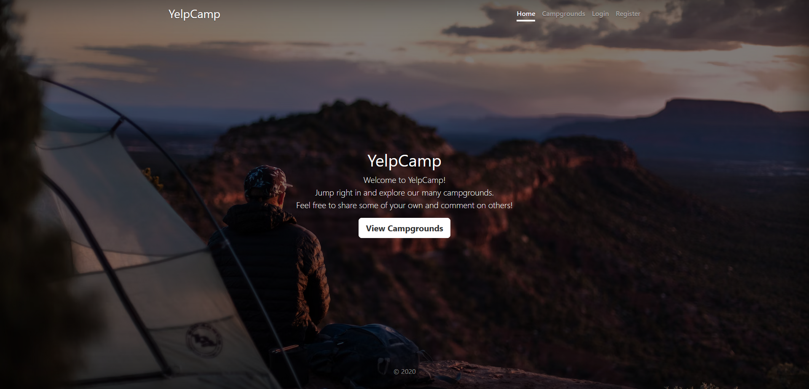

# YelpCamp

YelpCamp is a full-stack web project where users can log in, create entries for campgrounds and leave reviews. The app was built using Node.js, Express and MongoDB. Users are authenticated using Passport.js. This project is part of Colt Steele's [Web Developer Bootcamp](https://www.udemy.com/course/the-web-developer-bootcamp/) on Udemy.

Live demo [here](https://yelpcamp-6lu5.onrender.com).